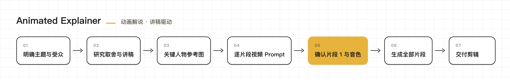
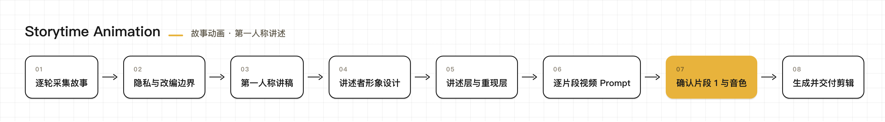
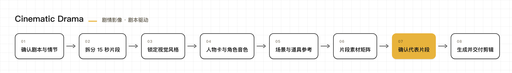
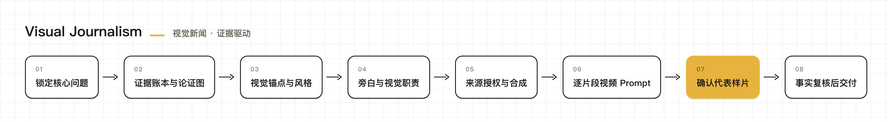

<h1 align="center">director</h1>

  <strong>从创意、剧本和视觉开发，到可以进入剪辑的完整视频素材。</strong>

  

  
  

  <a href="#创作模式">创作模式</a> ·
  <a href="#人物与声音">人物与声音</a> ·
  <a href="#安装">安装</a> ·
  <a href="#开始创作">开始创作</a>

## 关于 director

`director` 是一个用于导演和制作完整视频的 Agent Skill。

你可以从一句主题、一段亲身经历、一份定稿剧本，或一个需要调查的现实问题开始。director 会帮助你梳理内容、完成讲稿或制作拆解、确定视觉方向、设计人物与声音、规划镜头，并继续生成可供剪辑的视频片段。

它适合希望与 Agent 一起完成整支视频的人，而不只是获得一段文案、一组分镜或一个孤立镜头。

## 创作模式

director 根据作品的叙事核心提供四种创作模式。每种模式有独立的内容结构、视觉方法和制作流程。

### Animated Explainer｜动画解说

把抽象概念、人物思想和知识主题转化为具体场景、人物行动与视觉隐喻。适合解释概念、机制、理论、历史事件和知识主题。

https://github.com/user-attachments/assets/60e7e51f-8d3e-4004-a88d-f80f6f209d4d

### Storytime Animation｜故事动画

让讲述者既能面对观众回看往事，也能进入事件重现，在讲述与表演之间自然切换。适合亲身经历、身边人的故事，以及明确说明经过改编或虚构的第一人称作品。

### Cinematic Drama｜剧情影像

用统一的人物、场景和声音建立连续的剧情世界，让表演、对白、动作与镜头共同推动故事。适合把已有世界观、人物设定和剧本制作成 AI 电影、AI 漫剧、短剧或微电影。

https://github.com/user-attachments/assets/d7f23943-4fce-4c39-8815-3515fc354f87

### Visual Journalism｜视觉新闻

用事实、数据与现实素材完成视觉化报道和分析。适合财经、时政、产业和社会议题。

<!-- 视觉风格章节暂时隐藏，风格预览调整完成后恢复
## 视觉风格

director 可以根据内容选择合适的视觉语言，也可以使用你提供的自定义风格描述。风格会贯穿人物造型、场景设计、材质、色彩、光影与运动方式，同时每一期的画面和镜头都会围绕具体内容重新创作。

以下是部分视觉效果：

<table>
  <tr>
    <td colspan="2" align="center" valign="top">
       
      <b>电影感 3D 动画</b> 
      手绘质感、克制色彩与富有叙事感的电影光影 
      <a href="./modes/animated-explainer/styles/cinematic-3d-animation.md">查看风格详情</a>
    </td>
  </tr>
  <tr>
    <td width="50%" align="center" valign="top">
       
      <b>忧郁蓝调简笔画</b> 
      冷灰蓝纸面、笨拙铅笔线与安静内省的情绪 
      <a href="./modes/animated-explainer/styles/melancholic-blue-simple-line-animation.md">查看风格详情</a>
    </td>
    <td width="50%" align="center" valign="top">
       
      <b>柔和彩铅萌趣动画</b> 
      柔软轮廓、温暖纸纹与轻松亲切的可爱表达 
      <a href="./modes/animated-explainer/styles/soft-colored-pencil-cute-animation.md">查看风格详情</a>
    </td>
  </tr>
  <tr>
    <td width="50%" align="center" valign="top">
       
      <b>清爽线描蜡笔动画</b> 
      明快色块、清楚线描与清爽有序的二维世界 
      <a href="./modes/animated-explainer/styles/clean-line-crayon-animation.md">查看风格详情</a>
    </td>
    <td width="50%" align="center" valign="top">
       
      <b>多巴胺萌趣 3D 动画</b> 
      Q 弹角色、明亮配色与充满活力的画面层次 
      <a href="./modes/animated-explainer/styles/dopamine-cute-3d-animation.md">查看风格详情</a>
    </td>
  </tr>
  <tr>
    <td colspan="2" align="center" valign="top">
      
       
      <b>东方奇幻 3D 动画电影</b> 
      东方人物造型、华丽国漫材质与统一的半写实 3D 光影 
      <a href="./modes/cinematic-drama/styles/semi-realistic-3d-chinese-animation-film.md">查看风格详情</a>
    </td>
  </tr>
</table>

Storytime Animation 还提供[清爽白色圆身 Storytime 动画](./modes/storytime-animation/styles/clean-white-character-storytime-animation.md)，用白色圆身二维人物、利落粗线和清楚的表演呈现轻松、亲近的个人故事。

你也可以直接描述自己想要的画面，例如"温暖的彩铅绘本""克制的黑白编辑插画"或"雨夜中的东方奇幻 3D 电影"。
-->

## 人物与声音

需要跨镜头稳定出现的人物，可以先建立人物形象，再进入视频制作。剧情作品还可以为主要场景、服装、道具和说话角色建立统一参考，让不同片段保持连续。

声音既可以从[内置音色库](./references/reference-asset-library.md)中选择，也可以从第一个片段开始创造本期专属声音。Storytime Animation 可以保持固定讲述者身份，Cinematic Drama 则可以为不同角色分别设计声音。

## 安装

将本仓库克隆或复制到你的 Agent 可以读取的 skills 目录。如果你使用 Codex，也可以直接告诉它：

> 从 `https://github.com/s1dashu/director` 安装 `director` skill。

在 Codex 中可以使用 `$director` 显式调用；其他 Agent 请使用各自运行环境支持的 skill 调用方式。

## 开始创作

### 制作动画解说

> 使用 `director` 创作一支两分钟动画科普视频，主题是"为什么人会拖延"。语气温柔，使用手绘风格，先和我确认讲稿与视觉方向。

### 制作个人故事动画

> 使用 `director` 把这段亲身经历制作成 Storytime Animation。先和我一起整理故事细节、隐私边界和讲述者形象，再开始写稿。

### 制作剧情影像

> 使用 `director` 的 Cinematic Drama Mode，把我已经定稿的这场对决制作成 AI 漫剧。先建立人物、角色声音和场景参考，再拆分剧情片段。

### 制作视觉新闻

> 使用 `director` 的 Visual Journalism Mode，解释这个产业议题。先确认核心问题、事实截止时间和资料来源，再规划旁白、地图、图表与现实素材。

## 技术说明

`director` 通过 [LibTV CLI](./tools/libtv-cli.md) 完成媒体生成，同时也支持[即梦 CLI](./tools/jimeng-cli.md)。

## 许可证

本仓库的原创内容采用 [MIT License](./LICENSE) 开源。第三方文档和外部链接内容仍遵循各自权利人的许可条款。

  <strong>如果你也想和 Agent 一起导演出更好的视频，欢迎试用、分享，并为这个项目点一个 Star。</strong>

