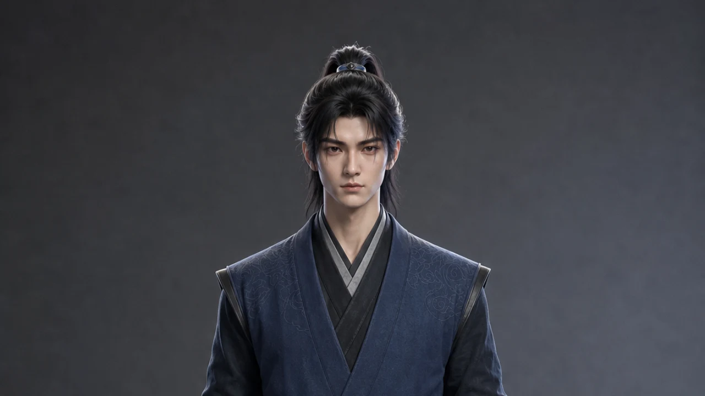
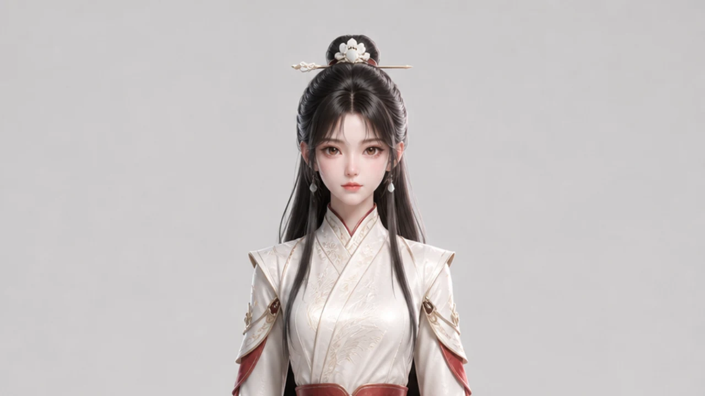

<h1 align="center">director</h1>

  <strong>简体中文</strong>

  <strong>从第一个想法开始，导演并制作一支完整视频。</strong>

  

  
  
  

  <a href="#它能帮你做什么">核心能力</a> ·
  <a href="#内置视觉风格">视觉风格</a> ·
  <a href="#安装">安装</a> ·
  <a href="#从一句话开始创作">开始创作</a>

`director` 是一个用于导演和制作完整视频的 Agent Skill，覆盖从创意、脚本到镜头设计、素材生成和最终交付的完整流程。

- **Animated Explainer（动画解说）**——通过清晰的旁白和动画场景，解释概念、思想、历史事件或知识主题。

https://github.com/user-attachments/assets/60e7e51f-8d3e-4004-a88d-f80f6f209d4d

- **Cinematic Drama（剧情影像）**——把已确认的世界观、人物和剧本制作成由行动、对白与冲突驱动的 AI 电影、AI 漫剧、短剧或微电影。

https://github.com/user-attachments/assets/d7f23943-4fce-4c39-8815-3515fc354f87

- **Storytime Animation（故事动画）**——把第一人称经历制作成动画故事，结合面向观众的讲述与事件重现。

https://github.com/user-attachments/assets/2c78454b-4c2e-42f9-ade9-3fbfb083dc5b

- **Visual Journalism（视觉新闻）**——围绕时事、财经、产业等现实议题，以证据驱动叙事，结合纪录片实拍、解释性动画、地图、图表和动态图形。

## 它能帮你做什么

- **选择正确的导演语法。** 根据作品由个人经历、知识解释、现实证据还是戏剧行动驱动，选择对应工作流。
- **把复杂知识讲清楚。** 从主题研究、内容取舍到旁白结构，帮助你建立一条观众听得懂、愿意继续听的叙事线。
- **把文字变成可生产的导演方案。** 将叙事拆成可执行单元，设计镜头、表演与调度，并按照当前 Mode 输出可生成的 Prompt。
- **让整支视频保持统一。** 通过文字 style、必要的人物参考与音色锚点，减少跨片段的人物漂移、画风跳变和声音不一致。
- **从创意一路走到可剪辑片段。** 不止交付文案，还能继续完成参考素材规划、片段生成和任务追踪，再把全部素材交给剪辑工具完成最终拼接与轻量修整。

## 内置视觉风格

Skill 按 Mode 管理视觉语言：Animated Explainer、Storytime Animation 与 Cinematic Drama 分别拥有自己的风格选择，不向用户展示其他 Mode 的专属风格。

这些风格是创作起点，不是套模板。Skill 会围绕每一期的内容重新设计场景、人物与镜头；你也可以为当前 Mode 提供自己的文字风格说明。视觉 style 不依赖图片参考资产。

<table>
  <tr>
    <td colspan="2" align="center" valign="top">
       
      <b>电影感 3D 动画</b> 
      手绘质感、克制色彩与富有叙事感的电影光影 
      <a href="./modes/animated-explainer/styles/cinematic-3d-animation.md">查看风格详情</a>
    </td>
  </tr>
  <tr>
    <td width="50%" align="center" valign="top">
       
      <b>忧郁蓝调简笔画</b> 
      冷灰蓝纸面、笨拙铅笔线与安静内省的情绪 
      <a href="./modes/animated-explainer/styles/melancholic-blue-simple-line-animation.md">查看风格详情</a>
    </td>
    <td width="50%" align="center" valign="top">
       
      <b>柔和彩铅萌趣动画</b> 
      柔软轮廓、温暖纸纹与轻松亲切的可爱表达 
      <a href="./modes/animated-explainer/styles/soft-colored-pencil-cute-animation.md">查看风格详情</a>
    </td>
  </tr>
  <tr>
    <td width="50%" align="center" valign="top">
       
      <b>清爽线描蜡笔动画</b> 
      明快色块、清楚线描与清爽有序的二维世界 
      <a href="./modes/animated-explainer/styles/clean-line-crayon-animation.md">查看风格详情</a>
    </td>
    <td width="50%" align="center" valign="top">
       
      <b>多巴胺萌趣 3D 动画</b> 
      Q 弹角色、明亮配色与充满活力的画面层次 
      <a href="./modes/animated-explainer/styles/dopamine-cute-3d-animation.md">查看风格详情</a>
    </td>
  </tr>
  <tr>
    <td colspan="2" align="center" valign="top">
      
       
      <b>东方奇幻 3D 动画电影</b> 
      东方人物造型、华丽国漫材质与统一的半写实 3D 光影 
      <a href="./modes/cinematic-drama/styles/semi-realistic-3d-chinese-animation-film.md">查看风格详情</a>
    </td>
  </tr>
</table>

Storytime Animation 拥有自己的[清爽白色圆身 Storytime 动画](./modes/storytime-animation/styles/clean-white-character-storytime-animation.md)：白色圆身二维人物、利落黑色粗线、有限平涂色块、清楚的喜剧表演，以及比人物更具体的环境。

Cinematic Drama 首轮提供[半写实 3D 国产动画电影](./modes/cinematic-drama/styles/semi-realistic-3d-chinese-animation-film.md)和[半写实东方奇幻暗黑 3D 电影](./modes/cinematic-drama/styles/semi-realistic-eastern-dark-fantasy-3d-film.md)两套候选 style，均需经首支样片验证后才能标记为已验证。

## 不只是画风，还有可复用的声音

除了按 Mode 管理的文字 style，Skill 还随包提供多种标准化中文与英文音色。

你可以直接选用现成音色，也可以从第一个片段开始创造本期专属声音。Skill 会先与你确认选择，不会擅自替你决定风格或音色。

Cinematic Drama 会在正式视频前为每个说话角色分别选择或生成音色参考，而不是全片只锁定一个旁白音色。

完整音色清单见[内置音色库](./references/reference-asset-library.md)。

## 创作模式与工作流程

`director` 会先根据作品的叙事核心选择 Mode，再进入对应的创作流程。个人经历、知识解释、剧情影像与现实议题拥有不同的内容结构、视觉策略和制作方法，不共用一套固定模板。

### Storytime Animation｜故事动画

以第一人称讲述者和个人经历为核心，适合亲身故事、身边人的故事，以及明确说明经过改编或虚构的第一人称作品。讲述者既可以面对观众回看往事，也可以进入事件重现，与过去的自己和其他人物共同表演。

1. 通过对话采集人物、目标、事件细节、转折与结局，并确认隐私和改编边界。
2. 建立“当时的我”和“现在的我”两层视角，写成自然、有个性、有事件变化的第一人称讲稿。
3. 确定讲述者形象、重要配角与声音，让人物身份在整支作品中保持一致。
4. 按故事节点拆分片段，为每段选择讲述、重现或两者切换，并设计具体表演与镜头。
5. 先完成一个代表片段，确认讲述者、画面与声音方向后，再制作其余内容。

### Animated Explainer｜动画解说

用旁白和动画讲清楚一个概念、机制、理论、人物思想、历史事件或知识主题。重点不是让画面重复旁白，而是把抽象观点转化为具体事件、视觉隐喻、人物行动和清楚的因果关系。

1. 明确主题、受众、时长，以及观众看完后应该真正理解的问题。
2. 研究并取舍信息，完成结构清楚、节奏自然的完整讲稿。
3. 选择适合内容的视觉语言，判断是否需要稳定出现的人物与声音。
4. 把讲稿拆成片段，为每段重新设计场景、动作、视觉隐喻和多镜头调度。
5. 先确认第一个片段的整体方向，再完成其余片段；需要发布时继续制作封面与成片素材。

### Cinematic Drama｜剧情影像

把已经确认的世界观、人物设定和剧本制作成 AI 电影、AI 漫剧、短剧或微电影。作品由人物行动、对白、关系和冲突推进，重点是让不同片段始终属于同一个剧情世界。

1. 读取并锁定已有世界观、人物、剧本，以及本次要制作的具体情节。
2. 按事件、对白、动作与情绪节拍拆分剧情，明确每个片段的开始状态和结束变化。
3. 为主要人物建立统一的形象、服装和声音，并为关键场景、道具或生物建立连续性参考。
4. 逐片段安排人物走位、表演、对白、动作、摄影和切镜，同时核对所有出场元素。
5. 先用代表性片段确认人物、声音、场景与风格，再完成其余剧情片段并交付剪辑。

### Visual Journalism｜视觉新闻

围绕财经、时政、产业和社会议题，以可核查的事实与证据推动叙事。现实影像、档案、地图、数据图表和解释性动画分别承担证明、定位、比较、解释机制和呈现后果的作用。

1. 锁定核心问题、事实截止时间，以及视频准备回答的主要判断。
2. 收集并核验来源，建立事实、数据、引语、限制和不确定性之间的证据关系。
3. 从证据中形成论点与因果链，为每段旁白同步安排对应的视觉职责。
4. 根据内容选择真实影像、档案、地图、图表、机制动画或人物现场，并确认来源与表达边界。
5. 先制作能代表整支作品信息密度的片段，完成画面、文字、数字与声音检查后，再推进完整视频。

无论选择哪一种 Mode，`director` 都会把内容、视觉、人物、声音和镜头组织成一条完整的制作路径，并在关键方向得到确认后再继续推进。

## 安装

将本仓库克隆或复制到你的 Agent 可以读取的 skills 目录。

如果你使用 Codex，也可以直接告诉它：

> 从 `https://github.com/s1dashu/director` 安装 `director` skill。

在 Codex 中，显式调用 skill 时需要使用 `$` 前缀，所以写作 `$director`。Skill 本身的名称仍然只是 `director`；其他 Agent 使用各自运行环境的调用约定。

### 从 `animated-voiceover` 迁移

本项目由 `animated-voiceover` 原地重命名为 `director`。GitHub 会保留仓库历史、Stars、Issues，并把旧仓库地址重定向到新地址；但用户本地复制安装的 skill 目录不会自动改名。

- 将已有 Git remote 更新为 `https://github.com/s1dashu/director.git`。
- 安装 `director` 后删除本地旧 `animated-voiceover` skill 目录，避免 Agent 同时发现两份不同版本的工作流。
- Codex 中把 `$animated-voiceover` 改为 `$director`；其他 Agent 使用各自的 skill 调用方式。

## 从一句话开始创作

安装后，你可以这样开始：

> 使用 `director` skill 创作一支两分钟的动画科普视频，主题是：两分钟了解斯多葛主义。

也可以带上自己的要求：

> 使用 `director` skill 把“为什么人会拖延”做成一支 90 秒心理科普动画。希望语气温柔，使用手绘风格，先和我确认讲稿与视觉方案。

已有世界观和剧本时，也可以直接进入剧情生产：

> 使用 `director` 的 Cinematic Drama Mode，把我已经定稿的这场对决制作成 AI 漫剧。先建立人物卡、角色音色和场景参考，再给我逐片段 Prompt。

Skill 会引导你完成必要选择，你不需要提前了解 Seedance Prompt、音色锚点或多模态素材连接方式。

## 工具与适用范围

`director` 优先推荐使用 [LibTV CLI](./tools/libtv-cli.md) 完成媒体生成，同时也支持 [Higgsfield CLI](./tools/higgsfield-cli.md) 和[即梦 CLI](./tools/jimeng-cli.md)。

## 许可证

本仓库的原创内容采用 [MIT License](./LICENSE) 开源。第三方文档和外部链接内容仍遵循各自权利人的许可条款。

  <strong>如果你也想和 Agent 一起导演出更好的视频，欢迎试用、分享，并为这个项目点一个 Star。</strong>

